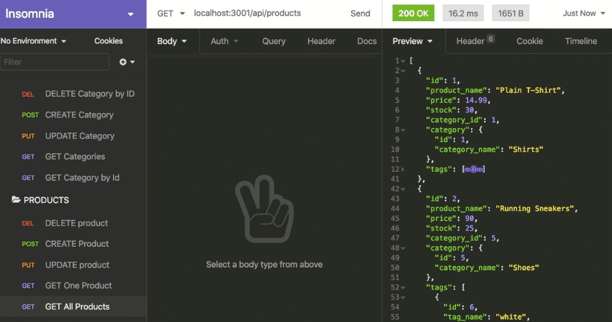

# E-commerce_Back-End_funk

## Description

I embarked on the journey of building this E-commerce application with the objective of crafting a robust set of routes tailored for internet retailers. The motivation behind this project was to empower retail owners with a comprehensive platform that streamlines inventory management, thus enhancing the overall retail experience.

Throughout the development process, I tackled the challenge of creating an E-commerce solution that seamlessly integrates essential functionalities. This encompassed creating well-defined routes that facilitate effortless operations such as retrieving, adding, updating, and removing items from the inventory.

By implementing this project, I acquired valuable skills in constructing the backbone of a backend architecture. This involved mastering the art of crafting RESTful APIs and leveraging HTTP methods like GET, POST, PUT, and DELETE. As a result, I gained proficiency in data manipulation and honed my ability to provide effective solutions to real-world problems faced by retailers.

This journey not only enabled me to build a functional E-commerce platform but also equipped me with the expertise to create scalable and adaptable backend systems. Through this experience, I've deepened my understanding of database interactions, request handling, and the importance of designing intuitive user experiences for retail professionals.

In summary, this project stands as a testament to my dedication to software development and showcases my ability to architect comprehensive solutions that cater to the unique needs of internet retailers. It's been an incredible learning experience that has enriched my skill set and solidified my passion for creating impactful applications.

## Table of Contents

- [Installation](#installation)
- [Usage Instruction](#usage-instruction)
- [Walkthrough Video:](#walkthrough-video)
- [GitHub Repository](#github-repository)
- [Screenshot](#screenshot)
- [Built With](#built-with)
- [Credits](#credits)
- [License](#license)
- [Badges](#badges)
- [Contribute](#how-to-contribute)
- [Tests](#tests)
- [Questions](#questions)

## Installation

In order to install this application to your local device use the steps below:

1. **Clone the Repository from GitHub:** Alternatively, you can download the ZIP folder from the repository's GitHub page.
```bash
git clone https://github.com/4funke/E-commerce_Back-End_funk.git
```
2. **Open the Repository in a Source Code Editor:**
Open your preferred source code editor (e.g., Visual Studio Code, Sublime Text) and navigate to the cloned repository's directory.

### Additional Resources
- [Walkthrough Video:](#walkthrough-video) Check out a live demo of our application
- [GitHub Repository](#github-repository) For more details and to explore the code

## Usage Instruction: 
#### Follow these steps to effectively utilize our application:

1. Navigate to the Repository: If you have already cloned the repository, navigate to the repository's directory using the following command:
```bash
cd E-commerce_Back-End_funk.co
```
2. Install Dependencies: Before running the application, install the necessary dependenciesby executing the following command:
```bash
npm install
```
3. Set Up Configuration: Set up any configuration files or environment variables that are required for your application. This might involve configuring your database connection, API keys, or other settings.
4. Database Setup: Set up the database and run any seed data scripts as needed. Run commands like the following:
```bash
mysql -u your_username -p
SOURCE db/schema.sql
exit
npm run seed
```
5. Start the Application: Once your configurations are in place, start the application using the following command:
```bash
npm start
```
6. Access the Application: The application should now be running locally. Access it by navigating to http://localhost:3001 in your preferred API testing tool, such as Insomnia.

By following these steps, you'll be able to seamlessly interact with the application and leverage its features to manage your E-commerce operations.

## Walkthrough Video:
[Walkthrough Video](https://drive.google.com/file/d/1-aT0zIgB_8ntHSX02-b2sLZ8LYU-dqJY/view)

## GitHub Repository:
[GitHub Repository](https://github.com/4FunkE/E-commerce_Back-End_funk)

## Screenshot


## Built With:
This project was developed using the following technologies and tools:
- [JSON](https://www.npmjs.com/package/json)
- [Node.js](https://nodejs.org/en/blog/release/v16.18.1/)
- [Dotenv](https://www.npmjs.com/package/dotenv)
- [Express](https://www.npmjs.com/package/express)
- [MySql2](https://www.npmjs.com/package/mysql2)
- [Visual Studio Code](https://code.visualstudio.com/)
- [Sequelize](https://www.npmjs.com/package/connect-session-sequelize)
### Technologies and Tools Overview
- JSON: Used for data representation and exchange.
- Node.js: The runtime environment for executing JavaScript code on the server.
- Dotenv:  Enables the usage of environment variables to manage configuration.
- Express: A fast and minimal web application framework for Node.js.
- Node MySql2: A MySQL driver for Node.js.
- Visual Studio Code: The integrated development environment used for coding.
- Sequelize: A powerful ORM (Object-Relational Mapping) library for Node.js, used for interacting with databases.

## Credits

Collaborators: 
- AskBCS Learning Assistants
- Andrew Bautista-Instructor
- Will-TA
- Starter code provided by [fantastic-umbrella](https://github.com/coding-boot-camp/fantastic-umbrella)

## License

This application is covered under the MIT license. [](https://opensource.org/licenses/MIT)

## Badges


## Features
- **Product Management:** 
  - Description: This feature allows users to manage products, including adding, updating, and deleting them.
  - Usage Instructions: Users with appropriate permissions can add new products by providing details such as name, price, and description. They can also edit existing products or remove them from the inventory.
  - Example: A retail owner can add a new product by entering the product name, setting the price, and providing a description. They can also update product information or remove items that are no longer available.

## How to Contribute

We welcome contributions to enhance and improve our project. Whether you're interested in fixing a bug, implementing new features, or enhancing documentation, your contributions are highly appreciated.

To contribute to our project, follow these steps:

1. Fork the Repository: Fork our repository to your own GitHub account by clicking the "Fork" button.
2. Clone the Repository: Clone the forked repository to your local machine using:
```bash
git clone https://github.com/4funke/E-commerce_Back-End_funk.git 
```
3. Create a New Branch: Create a new branch to work on your contribution using:
```bash
git checkout -b your-feature-branch 
```
4. Make Changes: Make your desired changes or additions to the codebase.
5. Test Your Changes: Test your changes thoroughly to ensure they work as expected.
6. Commit Your Changes: Commit your changes with a clear and concise commit message:
```bash
git commit -m "Add: Brief description of your changes" 
```
7. Push to Your Fork: Push your changes to your forked repository:
```bash
git push origin your-feature-branch 
```
8. Open a Pull Request: Open a pull request from your feature branch to our main repository. Provide a clear title and description for your pull request, outlining the changes you've made.
9. Review and Feedback: Participate in the discussion, address any feedback, and iterate on your changes as needed.

By following these steps, you contribute to the growth and enhancement of our project. We value your time and effort, and your contributions will make a positive impact.

If you're unsure about where to start or need assistance at any point, feel free to reach out. Together, we can make our project even better!

## Tests

n/a

## Questions
If you have any questions or need further assistance, feel free to reach out. You can contact me through my [GitHub profile](https://github.com/4FunkE) or via email at 4funkecodes@gmail.com. I'm here to help and support you in any way I can. Have a funke day!